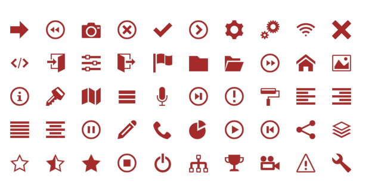

# Icons as web components

`THIS LIBRARY IS USED TO TEST USE OF WEB COMPONENTS.`



The module contains SVG icons as web components. It is a part of @dv4all monorepo created to test web components implementation as NPM packages (modules), how LERNA works and how custom components can be applied with React (NextJS), Vue (NuxtJS), Webpack and HTML5.

**This module is part of monorepo dv4all-wcp.**

There are demos of each implementation in the [demos folder of the monorepo](https://github.com/dmijatovic/dv4all-wcp/tree/master/demos).

## Usage

- install package from NPM

```bash
# install npm packages
npm install @dv4all/icons

```

### HTML5 implementation

Import cjs version of the library () file in the header of html file. See demos/html-demo/icons.html for an example of implementation.

```html
<!DOCTYPE html>
<html lang="en">
  <head>
    <meta charset="UTF-8" />
    <meta name="viewport" content="width=device-width, initial-scale=1.0" />
    <link rel="icon" href="img/favicon.png" sizes="16x16" type="image/png" />
    <title>Icons - web components</title>
    <!--IMPORT @dv4all PACKAGES to register customElements -->
    <script src="node_modules/@dv4all/icons/lib/dv4icons.cjs.js"></script>
    <!-- END IMPORT CUSTOM COMPONENTS-->
    <!-- OPTIONAL: IMPORT CSS VARIABLES FOR CUSTOM STYLING OF COMPONENTS -->
    <link rel="stylesheet" href="index.css" />
  </head>
  <body>
    <!--EXAMPLE ICON CUSTOM WEB COMPONENT -->
    <dv4-icon-cancel-circle class="dv4-icon" title="My new title" />
  </body>
</html>
```

For more details see [demos/html-demo](https://github.com/dmijatovic/dv4all-wcp/tree/master/demos/html-demo).

### NextJS implementation

NextJS supports SSR. On the server side customElements are not supported. You need to ensure that icons library is loaded only at the client side. I achieved this in the demo by dynamically importing web components in the app template in the React component life cycle method ComponentDidMount.

```javascript
export default class MyApp extends App {
  // IMPORT web components on CLIENT SIDE
  // othewise NextJS will try to render it
  // on the server and it will faile with error
  // about customElements.define ... undefined
  componentDidMount() {
    console.log("MyApp.didMount...");
    import("@dv4all/icons").then(d => {
      console.log("imported dv4icons...", d);
    });
  }
  // ... OTHER CODE ...
}
```

For more details see [demos/next-demo](https://github.com/dmijatovic/dv4all-wcp/tree/master/demos/next-demo).

### NuxtJS implementation

In the NuxtJS I added web components as plugins and set SSR flag to false. This was sufficient. Nuxt has also a component `<client-only>...</client-only>` that can be used to wrap markup that should only be rendered on the client side.

`extract from nuxt.config.js`

```javascript
  // .... OTHER CODE
  /*
  ** Plugins to load before mounting the App
  */
  plugins: [
    { src: '@/plugins/dv4-icons.js', ssr: false }
  ],
  // .... OTHER CODE
```

Content dv4-icons.js is simple import of npm package @dv4all/icons

```javascript
// import NPM package
import "@dv4all/loaders";
```

For more details see [demos/nuxt-demo](https://github.com/dmijatovic/dv4all-wcp/tree/master/demos/nuxt-demo)

## Icons

- [arrow-right](https://github.com/dmijatovic/dv4all-wcp/tree/master/icons/src/arrow-right): arrow-right svg icon as custom web component
- [backward](https://github.com/dmijatovic/dv4all-wcp/tree/master/icons/src/backward): backward svg icon as custom web component
- [camera](https://github.com/dmijatovic/dv4all-wcp/tree/master/icons/src/camera): camera svg icon as custom web component
- [cancel-circle](https://github.com/dmijatovic/dv4all-wcp/tree/master/icons/src/cancel-circle): cancel-circle svg icon as custom web component
- [checkmark](https://github.com/dmijatovic/dv4all-wcp/tree/master/icons/src/checkmark): checkmark svg icon as custom web component
- [circle-right](https://github.com/dmijatovic/dv4all-wcp/tree/master/icons/src/circle-right): circle-right svg icon as custom web component
- [cog](https://github.com/dmijatovic/dv4all-wcp/tree/master/icons/src/cog): cog svg icon as custom web component
- [cogs](https://github.com/dmijatovic/dv4all-wcp/tree/master/icons/src/cogs): cogs svg icon as custom web component
- [connection](https://github.com/dmijatovic/dv4all-wcp/tree/master/icons/src/connection): connection svg icon as custom web component
- [cross](https://github.com/dmijatovic/dv4all-wcp/tree/master/icons/src/cross): cross svg icon as custom web component
- [embed2](https://github.com/dmijatovic/dv4all-wcp/tree/master/icons/src/embed2): embed svg icon as custom web component
- [enter](https://github.com/dmijatovic/dv4all-wcp/tree/master/icons/src/enter): enter svg icon as custom web component
- [equalizer](https://github.com/dmijatovic/dv4all-wcp/tree/master/icons/src/equalizer): equalizer svg icon as custom web component
- [exit](https://github.com/dmijatovic/dv4all-wcp/tree/master/icons/src/exit): exit svg icon as custom web component
- [flag](https://github.com/dmijatovic/dv4all-wcp/tree/master/icons/src/flag): flag svg icon as custom web component
- [folder](https://github.com/dmijatovic/dv4all-wcp/tree/master/icons/src/folder): folder svg icon as custom web component. One element for open and closed folder icons
- [forward](https://github.com/dmijatovic/dv4all-wcp/tree/master/icons/src/forward): forward svg icon as custom web component.
- [home](https://github.com/dmijatovic/dv4all-wcp/tree/master/icons/src/home): home svg icon as custom web component.
- [image](https://github.com/dmijatovic/dv4all-wcp/tree/master/icons/src/image): image svg icon as custom web component.
- [info](https://github.com/dmijatovic/dv4all-wcp/tree/master/icons/src/info): info svg icon as custom web component.
- [key](https://github.com/dmijatovic/dv4all-wcp/tree/master/icons/src/key): key svg icon as custom web component.
- [map](https://github.com/dmijatovic/dv4all-wcp/tree/master/icons/src/map): map svg icon as custom web component.
- [menu](https://github.com/dmijatovic/dv4all-wcp/tree/master/icons/src/menu): menu svg icon as custom web component.
- [mic](https://github.com/dmijatovic/dv4all-wcp/tree/master/icons/src/mic): mic svg icon as custom web component.
- [next](https://github.com/dmijatovic/dv4all-wcp/tree/master/icons/src/next): next svg icon as custom web component.
- [notification](https://github.com/dmijatovic/dv4all-wcp/tree/master/icons/src/notification): notification svg icon as custom web component.
- [paint-format](https://github.com/dmijatovic/dv4all-wcp/tree/master/icons/src/paint-format): paint-format svg icon as custom web component.
- [paragraph](https://github.com/dmijatovic/dv4all-wcp/tree/master/icons/src/paragraph): paragraph svg icon as custom web component.
- [pause](https://github.com/dmijatovic/dv4all-wcp/tree/master/icons/src/pause): pause svg icon as custom web component.
- [pencil](https://github.com/dmijatovic/dv4all-wcp/tree/master/icons/src/pencil): pencil svg icon as custom web component.
- [phone](https://github.com/dmijatovic/dv4all-wcp/tree/master/icons/src/phone): phone svg icon as custom web component.
- [pie-chart](https://github.com/dmijatovic/dv4all-wcp/tree/master/icons/src/pie-chart): pie-chart svg icon as custom web component.
- [play](https://github.com/dmijatovic/dv4all-wcp/tree/master/icons/src/play): play svg icon as custom web component.
- [previous](https://github.com/dmijatovic/dv4all-wcp/tree/master/icons/src/previous): previous svg icon as custom web component.
- [share](https://github.com/dmijatovic/dv4all-wcp/tree/master/icons/src/share):
  share svg icon as custom web component.
- [stack](https://github.com/dmijatovic/dv4all-wcp/tree/master/icons/src/stack): stack svg icon as custom web component.
- [star](https://github.com/dmijatovic/dv4all-wcp/tree/master/icons/src/star): star svg icon as custom web component.
- [stop](https://github.com/dmijatovic/dv4all-wcp/tree/master/icons/src/stop): stop svg icon as custom web component.
- [switch](https://github.com/dmijatovic/dv4all-wcp/tree/master/icons/src/switch): switch svg icon as custom web component.
- [tree](https://github.com/dmijatovic/dv4all-wcp/tree/master/icons/src/tree): tree svg icon as custom web component.
- [trophy](https://github.com/dmijatovic/dv4all-wcp/tree/master/icons/src/trophy): trophy svg icon as custom web component.
- [video-camera](https://github.com/dmijatovic/dv4all-wcp/tree/master/icons/src/video-camera): video-camera svg icon as custom web component.
- [warning](https://github.com/dmijatovic/dv4all-wcp/tree/master/icons/src/warning): warning svg icon as custom web component.
- [wrench](https://github.com/dmijatovic/dv4all-wcp/tree/master/icons/src/wrench): wrench svg icon as custom web component.

**This module is part of monorepo [dv4all-wcp](https://github.com/dmijatovic/dv4all-wcp).**
